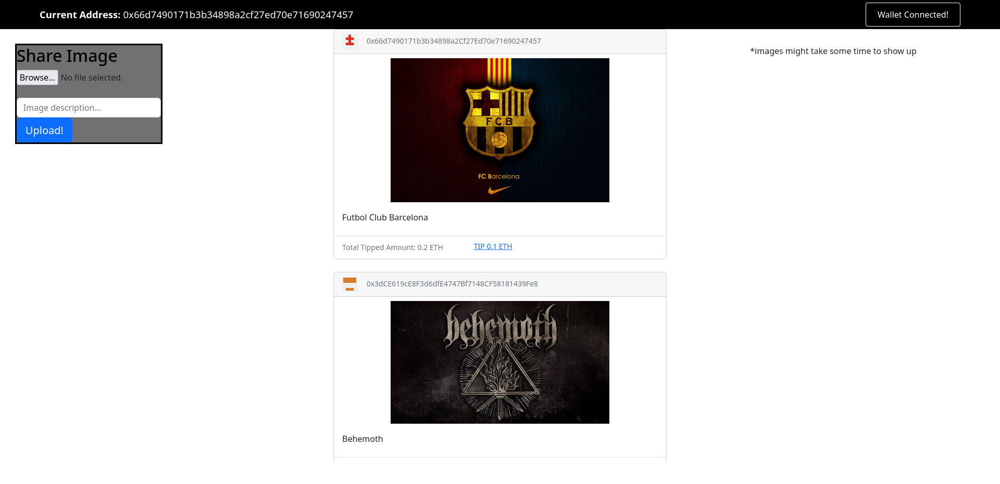

## About

This project is a proof-of-concept implementation of an Ethereum-based social media protocol, where the users can get rewarded (in Ethers) for creating posts, thus giving them a proper ownership for their content.
 
The highest tipped/rewarded post gets featured on top of the website and the others then go on in a decreasing order. This ends up giving the users, an incentive to create good quality and meaningful posts!
  
Post images are stored on the [IPFS](https://ipfs.tech/) via [Pinata's cloud service](https://www.pinata.cloud/) and the client-side application (built with ReactJs and deployed on the IPFS via [Fleek](https://fleek.co/)) talks to a Goerli testnet-based [smart contract](https://goerli.etherscan.io/address/0xe964b59a70A35Aa7605913FC349A4F15CC979C23).

## Project screenshot

## Steps to create a post

* Visit the project website and click on 'Launch App'
* Connect your Ethereum wallet (Metamask) to the app (make sure that the Goerli testnet is selected)
* Select the image that has to be uploaded from your local computer and add the related post/image description
* Click on the 'Upload' button and spend fake Goerli ethers (gas fee) to complete the transaction
* See your post come to life on the app!
